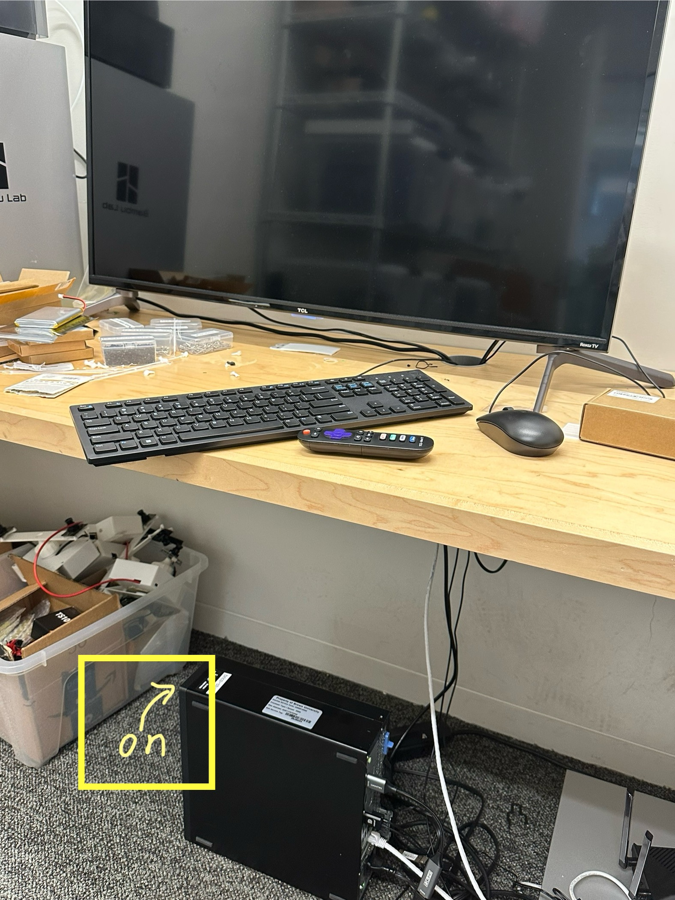
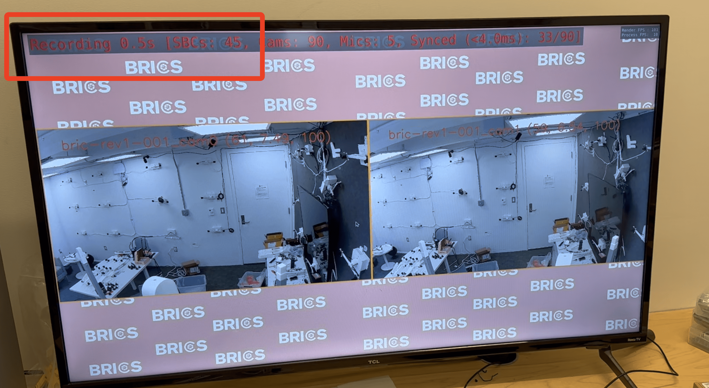

# BRICS Studio Usage Tutorial

## Overview

- BRICS Studio is a multi-view multi-modality video capture system.

## Get Started

### Requirements

- Please strictly follow the usage instructions in this tutorial.
- Please **do not change any BRICS settings** including both the hardware and software. If you find bugs (e.g. you want to change the exposure…), please reach out to PhD students or Professor.

### Basic Usage

1. Make sure the computer is turned on - the side indicator light should be on. In most cases, it should be on already and we can ignore this step.
    
    
    
2. Turn on the screen and enter **Computer (HDMI 3)**. Make sure you use **‘Ubuntu Wayland’**. The login passward is **bricsforever** (all in lowercase).
    
    
    
3. You will enter the desktop like (DO NOT CHANGE ANYTHING!!!)
    
    
    
4. Double-Click ‘**find-sbcs**’ icon on the desktop and wait a while. We should get 40 + 5 = 45 cameras ready in total. Then press ‘enter’ to close this ‘find-sbcs’ terminal.
    
    
    
5. Double-click ‘**start-all**’ on the desktop to enter the BRICS Studio capturing GUI.
    
    
    
6. The basic BRICS Studio capturing GUI looks like:
Also, there should be **90** cameras.
    
    
    
7. You can look up all the shortcut keys/commands by **‘shift + ?’**
    
    
    
8. ‘**Alt + A**’ to visualize all 90 camera views simutanously.
    
    
    
9. ‘**Alt + D**’ to check whether there are errors for some cameras. The box with orange/green/blue color indicates that camera is working well. But **the box with red color means that camera has an error which is probably ‘PTP error’.**
    
    
    
    
    
    - An option is to ignore this camera because the other views should be enough for almost all the capturing requirement…
    - To fix this error, we need to restart this camera by:
        1. Open a new terminal.
        2. Run the following command. Here we take bric-rev1-037-cam0 as an example.
            
            ```bash
            python ${HOME}/code/brics/tools/control_sbcs.py -i 37 -b bric-rev1 -u rev1 -p rev1 --restart
            ```
            
            
            
            
            
        3. Wait for a while (~30 seconds) and redo the step 4.
10. With all the cameras ready, now start capturing by ‘**Ctrl + Space**’! We can ‘**Ctrl + Space**’ again to stop recording.
    
    
    
11. All the recording and screenshot are stored in ‘**BRICS-LIVE-DATA**’ on the right bottom of the desktop.
    
    
    
    
    
12. Log out and turn off the screen after capturing.
13. All the data will be uploaded to CCV automatically in ~2days.

### Small Tips

- Most bugs can be addressed by restarting/rebooting and waiting a while…
- Practically we do not require all the 90 cameras to work perfectly. For example, 80 cameras are enough for most capturing.
- We do not need to worry about synchronization because a specialized tree structure takes care of that.
- Good Luck!